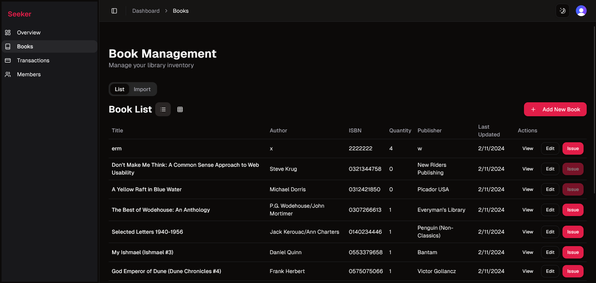
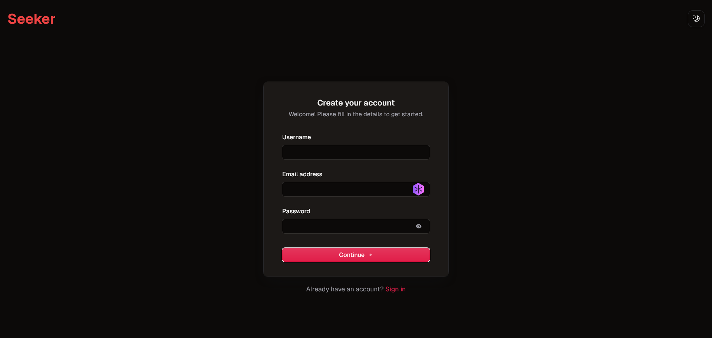

# Seeker - Library Management System

Seeker is a full-stack library management system

## Architecture Overview

1. **Next.js** - App Router, SSR, Frontend (Tailwind, Shadcn UI)
2. **tRPC** - End-to-end typesafe APIs
3. **FastAPI** - Python Backend

## Features

-   Dashboard with analytics and charts
-   Book management (list, add, import)
-   Member management
-   Transaction tracking
-   Dark smode support
-   Responsive design

## Screenshots

<div style="display: grid; grid-template-columns: repeat(2, 1fr); gap: 20px;">
  <div>
    <h3>Dashboard</h3>
    <p>Overview of library statistics</p>
    
  </div>

<div>
    <h3>Book Management</h3>
    <p>List and manage books</p>
    
  </div>

<div>
    <h3>Book Import</h3>
    <p>Import books from external sources</p>
    
  </div>

<div>
    <h3>Book Search</h3>
    <p>Search and filter books</p>
    
  </div>

<div>
    <h3>Book Return</h3>
    <p>Process book returns</p>
    
  </div>

<div>
    <h3>Create Book</h3>
    <p>Add new books to library</p>
    
  </div>

<div>
    <h3>Member Creation</h3>
    <p>Register new library members</p>
    
  </div>

<div>
    <h3>Member Management</h3>
    <p>Manage library members</p>
    
  </div>

<div>
    <h3>Debt Clearing</h3>
    <p>Clear member debts</p>
    
  </div>

<div>
    <h3>Transactions</h3>
    <p>View and manage book loans</p>
    
  </div>

<div>
    <h3>Sign In</h3>
    <p>User authentication</p>
    
  </div>

<div>
    <h3>Sign Up</h3>
    <p>New user registration</p>
    
  </div>

<div>
    <h3>Landing Page</h3>
    <p>Welcome page</p>
    
  </div>
</div>

## Getting Started

1. Clone the repository
2. Navigate to the project directory
3. Install dependencies for both frontend and backend:

    ```bash
    # Frontend (Next.js)
    cd frontend
    npm install

    # Backend (FastAPI)
    cd ../backend
    pip install -r requirements.txt
    ```

4. Set up environment variables:

    - Create a `.env` file in the root directory
    - Add the following variables:

    ```
    # Frontend environment variables
    PYTHON_API_URL=http://localhost:8000
    NEXT_PUBLIC_CLERK_PUBLISHABLE_KEY=your_clerk_publishable_key
    CLERK_SECRET_KEY=your_clerk_secret_key
    NEXT_PUBLIC_CLERK_SIGN_IN_URL=/sign-in
    NEXT_PUBLIC_CLERK_SIGN_UP_URL=/sign-up
    UPLOADTHING_TOKEN=your_uploadthing_token

    # Backend environment variables
    DATABASE_URL=your_postgresql_database_url
    ```

5. Run the development servers:

    ```bash
    # Frontend (in frontend directory)
    npm run dev

    # Backend (in backend directory)
    uvicorn main:app --reload
    ```

6. Open http://localhost:3000 in your browser

### Environment Setup Notes

-   Get Clerk API keys from [Clerk Dashboard](https://dashboard.clerk.dev)
-   Set up a PostgreSQL database and update DATABASE_URL accordingly
-   Configure UploadThing for file uploads

## Project Structure

-   `src/app`: Next.js app router pages and layouts
-   `src/components`: Reusable React components
-   `src/styles`: Global styles and Tailwind CSS configuration
-   `src/lib`: Utility functions and shared logic
-   `src/server`: Server-side code, including tRPC routers
-   `prisma`: Database schema and migrations

## Technologies Used

-   [Next.js](https://nextjs.org) - React framework for building web applications
-   [FastAPI](https://fastapi.tiangolo.com) - API for backend services
-   [Clerk](https://clerk.com) - Authentication
-   [Prisma](https://prisma.io) - ORM for database management
-   [Tailwind CSS](https://tailwindcss.com) - Utility-first CSS framework
-   [tRPC](https://trpc.io) - End-to-end typesafe APIs
-   [Recharts](https://recharts.org) - Charting library for React
-   [Shadcn](https://ui.shadcn.com) - UI components
-   [Frappe API](https://frappe.io/api) - API for fetching books
